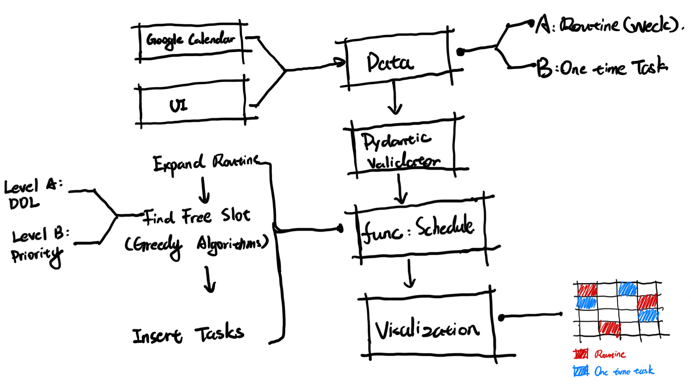
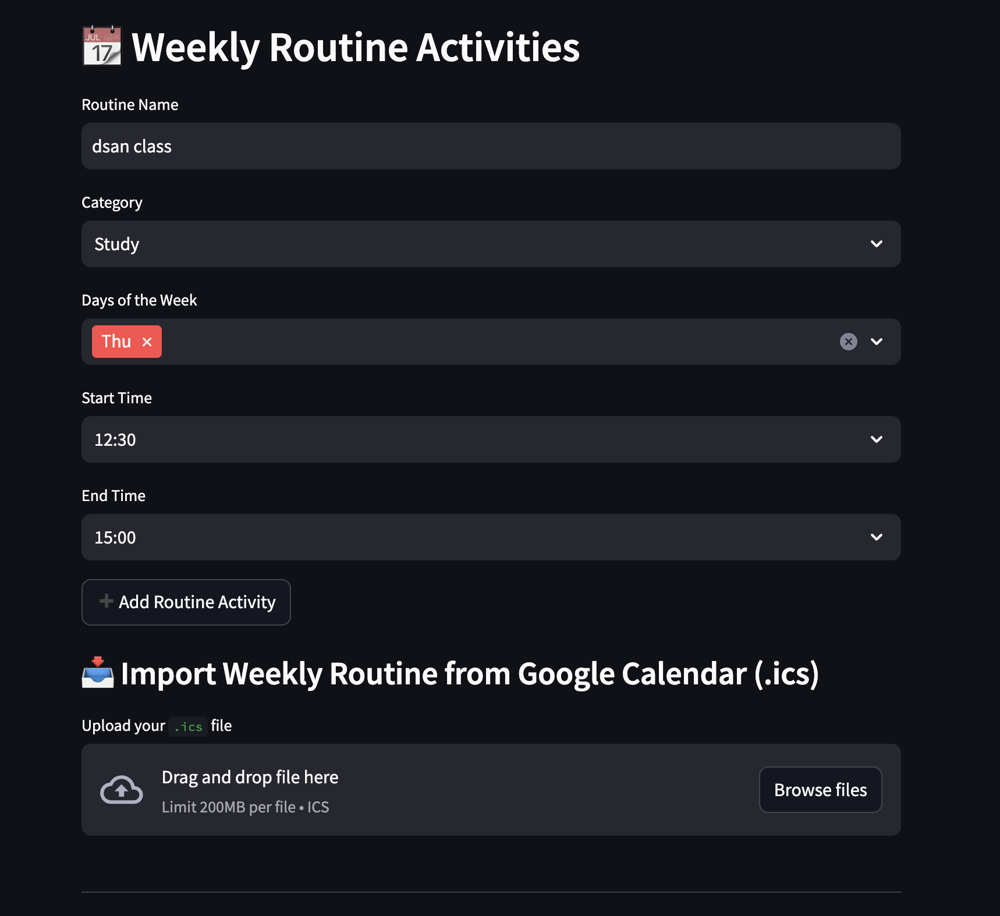
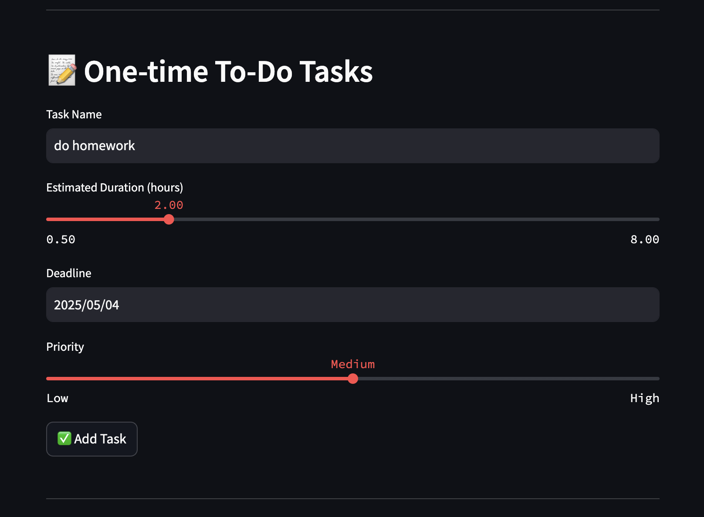
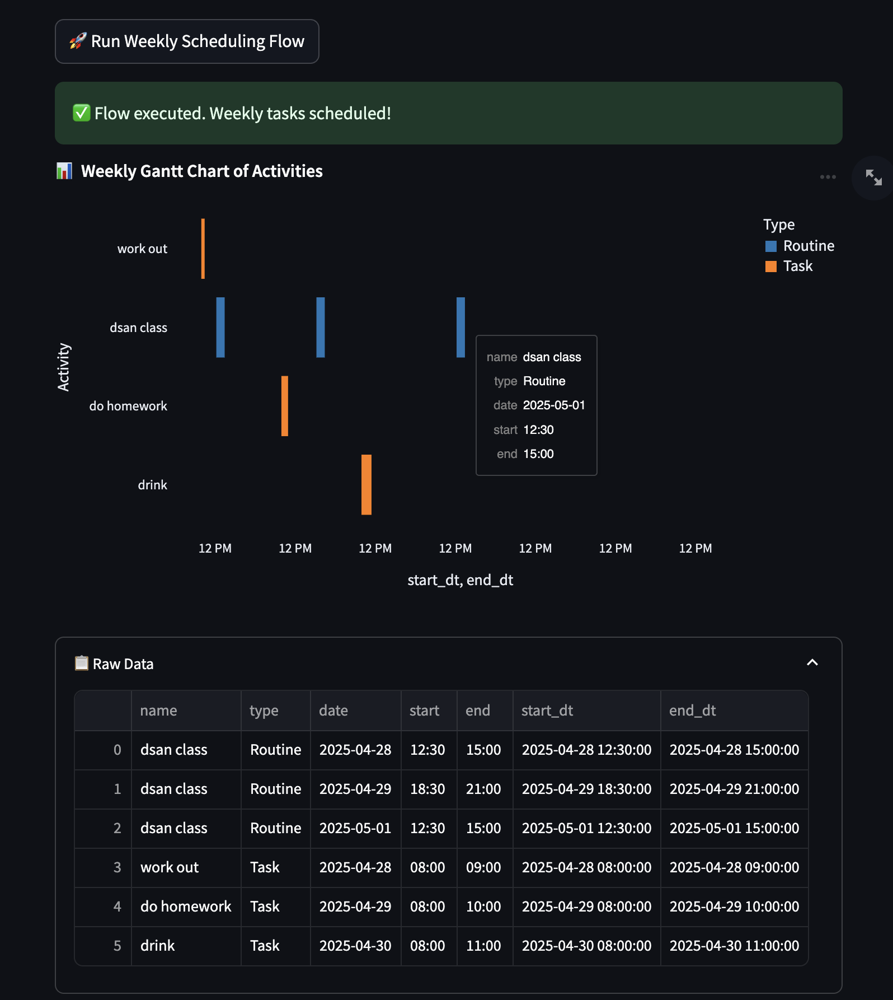
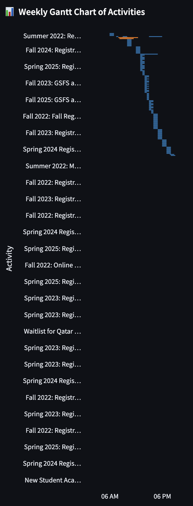
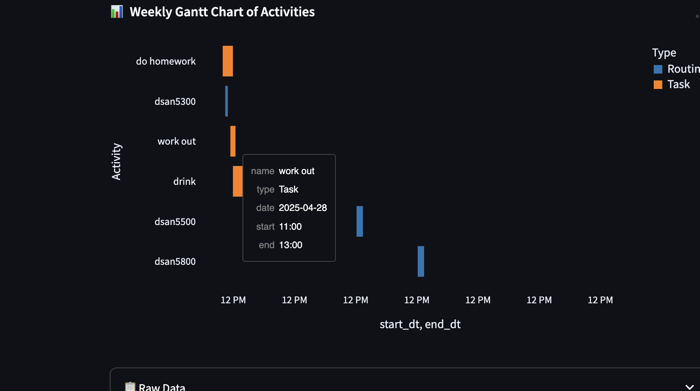

## Introduction

This project builds a data pipeline that automatically schedules one-time to-do tasks based on weekly routine availability. While one-time tasks are collected from UI input, weekly routines are partly derived from `.ics` calendar files that contain university events. The complete workflow includes the following steps:

- **Clean previous data**: Remove residual files from the last run to ensure a fresh start.  

- **Collect input data**: Gather weekly routine tasks (`routine.json`) and one-time to-dos (`tasks.json`) from user input.  

- **Parse external calendar events**: Extract `.ics` file content and merge it with the current routine data. (`routine.json`)

- **Validate data structure**: Use Pydantic models to validate task fields. Key logic ensures:  
  1. A routine task's start time must precede its end time.  
  2. A one-time task's deadline must not be earlier than the current date.  
  
- **Expand weekly routine**: Flatten the input routines into a day-by-day structure (`expanded_routine.json`) to prepare for scheduling.  

- **Schedule tasks**: Apply a **Greedy Scheduling Algorithm based on Deadline and Priority** to allocate one-time tasks into available time blocks.  

- **Visualize results**: Use Python Altair to present the final weekly schedule as a Gantt chart.

Although the full flow has not yet been deployed in production, it is designed to run at the start of each week, helping users automate weekly planning with minimal manual effort.

## Results 

The project basically accomplishes its core idea. It successfully takes input data and arranges one-time tasks based on the user's daily routine. The code is organized into a Prefect flow, though it has not yet been deployed. However, the program still has issues fully parsing the .ics file from Google Calendar — this problem is described in more detail in the following section.

## Future Improvements

- Parsing .ics file issue: The parse_ics_to_routine function still fails to correctly filter events within the current week — it often mistakenly includes events from the previous year.

- Conflict issue within routine tasks: Routine tasks come from two sources — user input via the UI and events parsed from the .ics file. However, the project currently lacks logic to handle time conflicts between routine tasks from these two sources.  

- Schedule conflict issue: The scheduling function sometimes overlaps tasks with existing weekly routines. This logic needs further refinement to better handle conflicts.

- Lack of intelligent task categorization: The scheduling function should become more intelligent by identifying the type of each task and scheduling accordingly. For instance, if a task is classified as entertainment (e.g., hanging out with friends), it should be arranged on weekends. If the task is identified as a health-related activity (e.g., working out), it should be distributed throughout the week.

## GitHub Repository

- GitHub Link: https://github.com/RX67-RX67/5500.git

The repository maily contains the following parts:

- code: Contains a Python script called build_UI.py that builds the overall user interface, and another script flow.py that uses the Prefect API to construct the data pipeline (not yet deployed). This folder also includes several other Python scripts that perform specific functions used throughout the pipeline.

- data: Mainly used to store .ics files downloaded from Google Calendar, as well as data extracted from the UI input and data generated during the pipeline process.

- image: Contains a diagram of the project design concept and screenshots that showcase the results of the project.

- report: Contains the Quarto (.qmd) file used to generate this report, along with the rendered HTML output.

How to test: Open the script code/build_UI.py and run the following command in the terminal: streamlit run code/build_UI.py. Input weekly routine, one-time tasks and click "Run Weekly Scheduling Flow" button.